# address-comments

A skill that tells a coding agent to find review markers
left for it in source and docs (`AGENT:`, `TODO(agent)`,
`TODO(code-review:<id>)` and a few related shapes), make the
change each one asks for, remove the markers it addressed,
and append an entry to a review log. Its package is one
instruction file plus a Codex interface file, and holds no
program.

address-comments ships one spec file and no runnable code.

The claim is about the installed package. The Python
scripts elsewhere in this repository record, render and test
it, and neither install block copies them.

<picture>
  <source
    media="(prefers-reduced-motion: reduce)"
    srcset="assets/poster.svg"
  />
  
</picture>

The demo shows the output of a packaging test, not an agent
addressing a marker. It is reconstructed from
[`evidence/transcripts/package-check.txt`](evidence/transcripts/package-check.txt),
the recorded output of
[`tests/test_package.py`](tests/test_package.py).

**Not measured, stated up front.**

- No agent ran address-comments to produce the evidence
  here. No marker was found, addressed or removed, and no
  review log was written.
- Whether an agent that reads `SKILL.md` follows it has not
  been measured.
- What the `rg` search command in `SKILL.md` matches and
  misses is not evidenced here. For this release it was run
  in one throwaway check of how it treats the review log,
  described below.
- Neither Claude Code nor Codex was started to confirm that
  the invocation names below resolve.

## What the claim covers

In the claim, address-comments is the skill package under
[`skills/address-comments/`](skills/address-comments/),
which is what both install blocks copy. It holds two files:
`SKILL.md`, the spec, and `agents/openai.yaml`, the Codex
interface file. The packaging test checks that neither is
executable, opens with a `#!` line, or has another suffix.
`SKILL.md` does quote an `rg` command as text for the agent
to run.

The repository around the package also holds Python scripts
that record the transcript, build and check the images, and
test the packaging. They are not part of the skill.

## What is in it

[`skills/address-comments/SKILL.md`](skills/address-comments/SKILL.md)
tells the agent:

- which markers to act on: the labels `AGENT:`, `AGENTS:`,
  `TO AGENT` and `TO AGENTS` in a comment, the shapes
  `TODO(agent)` and `TODO(agents)`, any `<name> says:` label
  a per-repository wrapper registers, and
  `TODO(code-review:<id>)` in a comment or in a
  `CODE_REVIEW.gpt.md` checklist entry. A plain `TODO:` is
  not a marker;
- how to search for them, with one `rg` command, and to read
  each match before acting on it;
- the workflow: classify each marker, make the change (or,
  in Plan Mode, write a plan instead), check a
  `TODO(code-review:<id>)` finding before acting on it,
  remove addressed markers, run the repository's formatter
  or linter over the files it touched while keeping
  formatting changes to the lines it edited, and append a
  review-log entry;
- what to limit its changes to: the requested fix or
  documentation or process change, removing markers that
  were addressed or proven stale, and the review-log entry;
  and not to stage, commit or push unless the user asks;
- where the review log goes, described next.

### The review log

You choose where the log goes: name a path when you invoke
the skill, or bind one in a per-repository wrapper. With no
path given, `SKILL.md` tells the agent to use
`.address-comments/review-log.md` at the root of the
repository being edited, and to create that directory if it
is missing. The skill does not add that path to the
repository's ignore rules. Add `.address-comments/` to them
if the log should stay out of version control.

The `rg` command in `SKILL.md`, run as written from the
repository root with standard input closed, skipped a log at
the default path in a check with ripgrep 15.2.0 in a
throwaway Git repository,
whether or not `.address-comments/` was in its ignore rules.
Other invocations matched marker text quoted in that log in
the same check: adding `--hidden`, adding `-uu`, naming the
log file or its directory as the path to search, and moving
the log to a directory whose name does not start with a dot.
That check is not part of this repository's evidence. In
the same check, when standard input was an open pipe, the
command as written waited on standard input instead of
searching the repository, and had not returned after two
minutes, when it was stopped.

`SKILL.md` calls the log private operational memory and
tells the agent not to publish it or copy it into shareable
docs. That is an instruction to the agent; nothing here
enforces it. Its Private Boundary section also mentions a
publish-boundary sentinel and provenance bookkeeping that a
wrapper may name. Without a wrapper, `SKILL.md` names no
sentinel or bookkeeping of its own, and the boundary it asks
the agent to follow is the repository's own.

## Not included

Two other skills from the same series work with
address-comments. It does not need either one, and neither
ships here:

- `review-watch`, published as `trycopilotai/review-watch`,
  is a review watcher that calls address-comments. Without
  it, you invoke address-comments yourself.
- `multi-persona-code-review`, published as
  `trycopilotai/multi-persona-code-review`, writes the
  `TODO(code-review:<id>)` markers that address-comments
  consumes. Without it, `SKILL.md` still tells the agent to
  treat markers of that shape the same way, whoever wrote
  them, along with all the other markers.

Nothing in `SKILL.md` checks whether either one is
installed. Whether `multi-persona-code-review` writes its
checklist under the name `CODE_REVIEW.gpt.md` that
`SKILL.md` looks for was not checked for this release.

`SKILL.md` also expects things this repository does not
provide:

- the `rg` (ripgrep) command on the machine the agent runs
  on, for the search;
- the repository's own formatter or linter, for the
  formatting step. `SKILL.md` leaves a wrapper to name the
  command and does not name one itself;
- optionally, a per-repository wrapper skill that binds the
  review-log path, extra `<name> says:` labels and search
  excludes, and delegates to this skill. None ships here.
  Without one, `SKILL.md` tells the agent to use the log
  path you name or the default above, and no `<name> says:`
  labels or repository-specific exclude globs are added.

## What changed from the original

`SKILL.md` comes from a private repository. For this
release:

- it moved from `skill/SKILL.md` to
  `skills/address-comments/SKILL.md`;
- the review log, which the original left for a host wrapper
  to place, now has the documented default above, and a
  wrapper became optional;
- the "Mutation Discipline" section was carried in from the
  original repository's agent instructions, where it applied
  to running the skill and was headed "Mutation discipline",
  with "the host's private review-log entry" changed to "the
  review-log entry (see Review Log)";
- a paragraph names `multi-persona-code-review` as the skill
  that writes `TODO(code-review:<id>)` markers;
- the install paragraph says to copy the skill's directory
  rather than `skill/SKILL.md`;
- the example of a registered operator label, which named a
  person, is now `reviewer says:`;
- to match, the frontmatter description names the default
  log path and calls the wrapper optional, workflow step 8
  points at the new Review Log section instead of "the
  host's private review log", and the Private Boundary
  section says a wrapper "may name a different" log path
  instead of naming "the concrete" one.

Everything else in `SKILL.md`, including the marker shapes,
the `rg` command and the `CODE_REVIEW.gpt.md` checklist name,
is as it was.
`CODE_REVIEW.gpt.md` is the name of a checklist file
`SKILL.md` looks for in the repository being edited; it is
not a file in this repository.

## Use it

Read
[`skills/address-comments/SKILL.md`](skills/address-comments/SKILL.md)
before you install it. It tells an agent to take
instructions from comments in the repository it works in;
[`SECURITY.md`](SECURITY.md) says what that means. Both
installs below are pinned to a tag rather than to `main`.

### Claude Code

Save this as `install.sh` and run it with `sh install.sh`.
It sets `set -eu` and an `EXIT` trap, so pasting it straight
into an interactive shell can end that shell if a command in
it fails.

```sh
set -eu
release=v0.1.0
install_target="$HOME/.claude/skills/address-comments"
install_parent="$(dirname "$install_target")"
mkdir -p "$install_parent"
install_tmp="$(mktemp -d "$install_parent/.address-comments.XXXXXX")"
install_stage="$install_tmp/package"
rollback_install() {
  if [ ! -e "$install_target" ]; then
    if [ -e "$install_tmp/previous" ]; then
      mv "$install_tmp/previous" "$install_target"
    fi
  fi
  rm -rf "$install_tmp"
}
trap rollback_install EXIT
git clone --quiet --depth 1 --branch "$release" \
  https://github.com/trycopilotai/address-comments \
  "$install_tmp/clone"
mkdir -p "$install_stage"
cp -R "$install_tmp/clone/skill/." "$install_stage/"
if [ -e "$install_target" ]; then
  mv "$install_target" "$install_tmp/previous"
fi
mv "$install_stage" "$install_target"
trap - EXIT
rm -rf "$install_tmp"
```

The name to invoke is `/address-comments`. As stated above,
that was not confirmed in a running Claude Code.

### Codex

Save this one the same way. The only line that differs from
the block above is `install_target`.

```sh
set -eu
release=v0.1.0
install_target="$HOME/.agents/skills/address-comments"
install_parent="$(dirname "$install_target")"
mkdir -p "$install_parent"
install_tmp="$(mktemp -d "$install_parent/.address-comments.XXXXXX")"
install_stage="$install_tmp/package"
rollback_install() {
  if [ ! -e "$install_target" ]; then
    if [ -e "$install_tmp/previous" ]; then
      mv "$install_tmp/previous" "$install_target"
    fi
  fi
  rm -rf "$install_tmp"
}
trap rollback_install EXIT
git clone --quiet --depth 1 --branch "$release" \
  https://github.com/trycopilotai/address-comments \
  "$install_tmp/clone"
mkdir -p "$install_stage"
cp -R "$install_tmp/clone/skill/." "$install_stage/"
if [ -e "$install_target" ]; then
  mv "$install_target" "$install_tmp/previous"
fi
mv "$install_stage" "$install_target"
trap - EXIT
rm -rf "$install_tmp"
```

The name to invoke is `$address-comments`. That was not
confirmed in a running Codex either.

Each block works in a temporary `.address-comments.*`
directory beside the target and removes it on exit. An
existing install at the target is replaced.

While it clones, `git` prints
`warning: refs/tags/v0.1.0 <object> is not a commit!` and a
note that `HEAD` is detached, despite `--quiet`. Both are
expected for a clone pinned to an annotated tag. That output
was seen when both blocks were run against a local copy of
this repository with `file://` in place of the GitHub URL;
neither block has been run against GitHub.

Both blocks copy through `skill/`, a symlink to
`skills/address-comments/`, so the installed directory holds
`SKILL.md` and `agents/` as real files. They assume a
checkout that keeps symlinks. With `core.symlinks` set to
false, `cp` failed and the block left an existing install in
place, when the Claude Code block was run against a local
copy of this repository. The repository also
carries `.claude-plugin/plugin.json` and
`.codex-plugin/plugin.json` for a marketplace. No
marketplace lists this skill, so no marketplace install is
described here.

## Evidence

`evidence/transcripts/package-check.txt` is the recorded
output behind the claim at the top of this file. It records
one run of `python3 tests/test_package.py -v` in a throwaway
directory that held a copy of `skills/` and of the test.
`scripts/record_session.py` wrote three of its lines: the
two lines that start with `$` and the final `exit status:`
line. The rest is the test's output, with one edit: the elapsed time that unittest prints after the test
count was removed. The transcript itself carries no notice
of that. `evidence/demo-manifest.json` is where the edit is
declared, as `strip-test-duration`, beside the SHA-256 of
`SKILL.md`, of `agents/openai.yaml` and of the test, the
command, the interpreter, the date, and the SHA-256 of the
transcript. The manifest also records that no agent invoked
the skill.

This is evidence about the files in the package. It is not
evidence that an agent following `SKILL.md` addresses
markers correctly.

`make check` runs the packaging test and a second suite that
ties this file, both plugin manifests, the transcript and
the demo images to each other.

## Contributing

See [`CONTRIBUTING.md`](CONTRIBUTING.md).

## Security

See [`SECURITY.md`](SECURITY.md).

## License

MIT. See [`LICENSE`](LICENSE).

## Not affiliated with GitHub or GitHub Copilot

The `trycopilotai` organisation name is not a claim of any
relationship with GitHub Copilot. This project is not
affiliated with, endorsed by, or sponsored by GitHub, Inc.
GitHub and GitHub Copilot are trademarks of GitHub, Inc.
